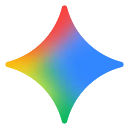

  

# Gemini Desktop App

Gemini Desktop App is a simple, lightweight wrapper for the official [Gemini](https://gemini.google.com/) website. It turns the Gemini web experience into a standalone, installable application on Windows, giving you quick access via a desktop shortcut — no browser tabs needed.

## Installation

Download the latest release from the [Releases page](https://github.com/YOUR_USERNAME/Gemini-Desktop-App/releases) and run the `.exe` file.

## Usage

- Open the app from your desktop or start menu.
- Press **Alt + Space** to quickly show/hide the window and focus the input area.
- Interact with Gemini as you would in a browser.

## Notes

- This is not a modified version of Gemini — it simply wraps the website in an installable window.  
- Internet connection is required to use the app.  
